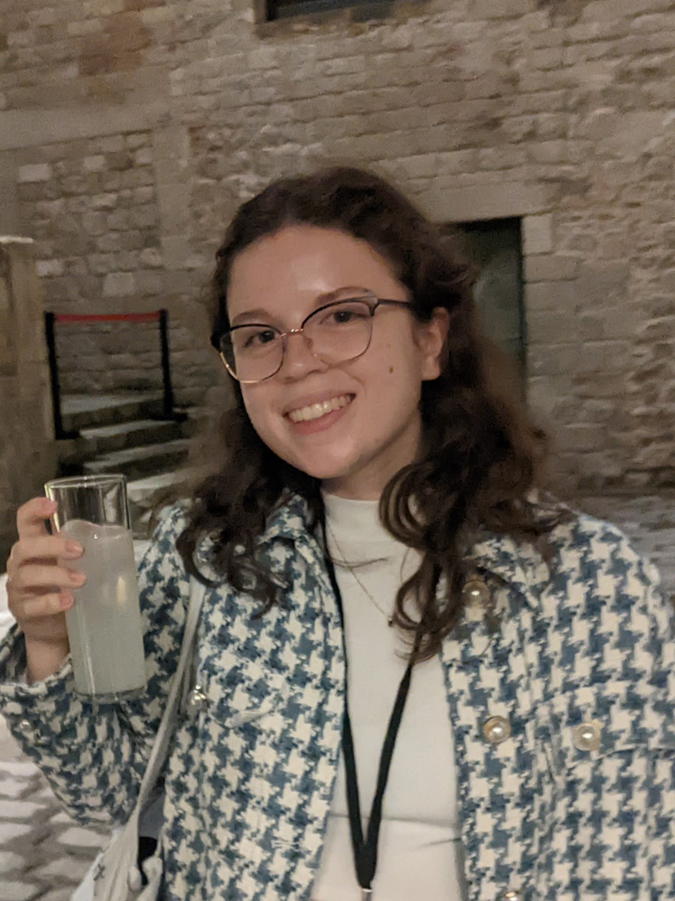

# Isabella
:green_heart:

Hi! My name is Isabella Kroon. I am a sophomore student at Duke Kunshan University, majoring in Computation and Design with a track in Social Policy and an Environmental Sustainability concentration. I'm interested in how statistics and computation can be used to understand environmental issues and inform environmental policy.

## Projects

| Platform | Link |
| ------- | ------- |
| CoLab | ["Problem Set 1"](https://github.com/Rising-Stars-by-Sunshine/Isabella/blob/main/Problem%20Set%201/Isabella_Problem_Set_1_Demo_Ethereum_Blockchain_API.ipynb) |
